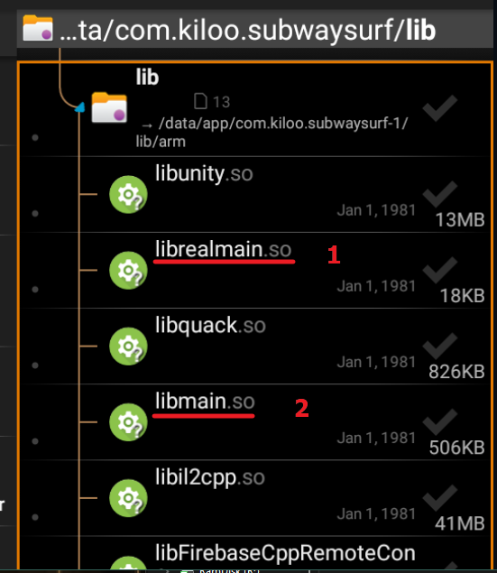
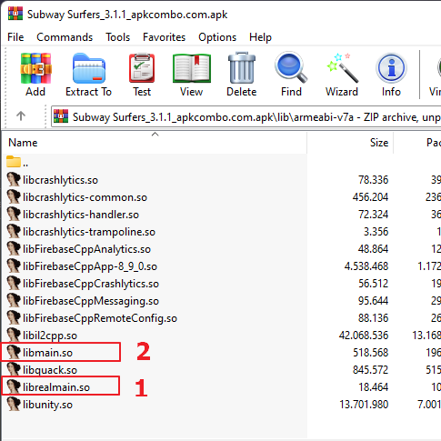
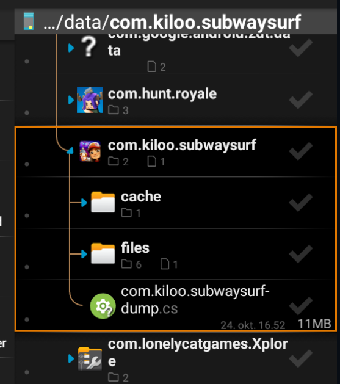

# Auto-Il2cppDumper
Il2CppDumper without Magisk/Zygisk, dump il2cpp data at runtime, can bypass protection, encryption and obfuscation.

This project is based on BrianGIG [Auto-Il2cppDumper](https://github.com/BryanGIG/Auto-Il2cppDumper) which I continue to maintain it

# How to use
Download pre-compiled libs [HERE](https://github.com/AndnixSH/Auto-Il2cppDumper/releases) and follow steps below

Note: Non-root methods involves modifying APK file, you may need to bypass APK integrity or signature check if it's present. I won't get into the details of bypassing anything because it is simply out of the scope

## Method 1: Fake lib
This is a trick to load our own libunity.so or libmain.so and load game's renamed original lib librealunity.so or librealmain.so. Can't decide which lib? Try libmain.so first as it sometimes work better than libunity.so or vice versa

### Root
- Make sure you know the architecture of the game and your device before proceed
- Use any file manager app that can access root. Go to /data/data/(package name)/lib or /data/app/(obfuscated name)/(package name-obfuscated name)/lib
- Rename original libunity.so to librealunity.so or original libmain.so to librealmain.so
- Put our lib file libunity.so or libmain.so to the lib folder
  

### Non-root
Some games may have APK integrity and signature check. You may need to bypass it before adding Il2CppDumper

- Open APK file as ZIP using Winrar. 7zip or other zip utilities
- Rename game's libunity.so to librealunity.so or libmain.so to librealmain.so
- Put our fake lib file libunity.so or libmain.so to the lib folder
  
- Zipalign and sign the APK file
- Install the APK

### Method 2: Lib call
If renaming lib doesn't work, try this method.

- Decompile the game using Apktool
- Copy libil2cppdumper.so into the lib folder. Make sure only copy same ABIs as the target app, for example if target app has only armeabi-v7a, then you should only copy armeabi-v7a
- Search the main activity in AndroidManifest.xml. Example: com.gameloft.android.XamarinMainActivity

```xml
<activity android:configChanges="density|fontScale|keyboard|keyboardHidden|layoutDirection|locale|mcc|mnc|navigation|orientation|screenLayout|screenSize|smallestScreenSize|touchscreen|uiMode" android:label="@string/icon_label" android:launchMode="singleTop" android:multiprocess="false" android:name="com.gameloft.android.XamarinMainActivity" android:resizeableActivity="false" android:screenOrientation="sensorLandscape" android:theme="@style/Theme.acp.notitlebar.fullscreen">
    <intent-filter>
        <action android:name="android.intent.action.MAIN"/>
        <category android:name="android.intent.category.LAUNCHER"/>
    </intent-filter>
</activity>
```

- Locate the said main activity in the smali folder, can be \smali_classes(number)\com\gameloft\android\XamarinMainActivity.smali if multidex). You must look through all smali classes until you found it

- Insert this lib call into onCreate function below `.locals` XX

```smali
 const-string v0, "il2cppdumper"
 
 invoke-static {v0}, Ljava/lang/System;->loadLibrary(Ljava/lang/String;)V
```

Like

```smali
.method protected onCreate(Landroid/os/Bundle;)V
    .locals 2

    const-string v0, "il2cppdumper"
 
    invoke-static {v0}, Ljava/lang/System;->loadLibrary(Ljava/lang/String;)V

    whatever code below
```

- Re-compile, zipalign, sign the APK
- Install the APK

### Dumping
- Run the game
- Wait a few seconds. Let the game load into main screen
- Once the dump is complete, it will save the dump.cs in /storage/emulated/0/Android/data/(Package name)/
  
- If there is no dump.cs, check logcat using Matlog or Android Studio. Game usually crash or freeze if dump fails

### Obfuscated names
Names can't be deobfuscated. Once they are obfuscated/renamed, it can't be reverted back to original, the APK doesn't even have a brain to memorize all original names. Instead, try find older version without obfuscation, or debug the game using GG, frida, gdb, lldb or others. If you can't do any of these, maybe guess the functions and try one by one :P

### Bypass more games?
No idea since bypassing is not my thing, but if you know, feel free to make a pull request. For now, Issues is closed

# Usage (If you want to complie by yourself)

In config header `jni/Includes/config.h`:

`UseFakeLib` is to use it as root mode

`Sleep` is to delay dumping. Increase if getting issue with dumper, like if not fully dumped

# Credits
- Perfare [Zygisk-Il2CppDumper](https://github.com/Perfare/Zygisk-Il2CppDumper)
- BrianGIG [Auto-Il2cppDumper](https://github.com/BryanGIG/Auto-Il2cppDumper)